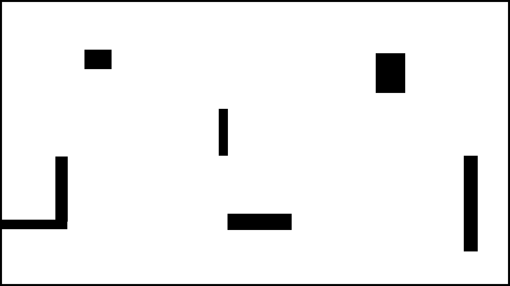

# 🎮 Pepega Pega: Reinforcement-Learning-Tag-Game

A "tag" game where two AIs (intelligent agents) compete in a map with obstacles, learning to **chase** or **flee** based on reward feedback.

Built in **Python with Pygame**, using **linear supervised learning** to train agents to master the game.

---

## 📷 Screenshots

  
*Two agents (red and blue) competing. The one with the black ring is the "chaser".*

---

## 🚀 Features

- 🧠 Two trainable AIs:
  - `AggressiveAgent`: learns to chase
  - `LinearAgent`: learns to flee
- 🧱 Custom map with obstacles (loaded as PNG image)
- 🔁 Continuous training over multiple matches
- 📈 Reward-based learning: chaser gets `1`, chased gets `0`
- 🧩 Pixel-perfect wall collision detection
- 🎯 "Black ring" system: indicates who is the chaser

---

## 🛠️ Technologies Used

- **Python 3.x**
- **Pygame** – game rendering and physics
- **NumPy** – mathematical and vector calculations
- **JSON** – saving and loading agent weights
- **Simple AI** – linear model with gradient descent

---